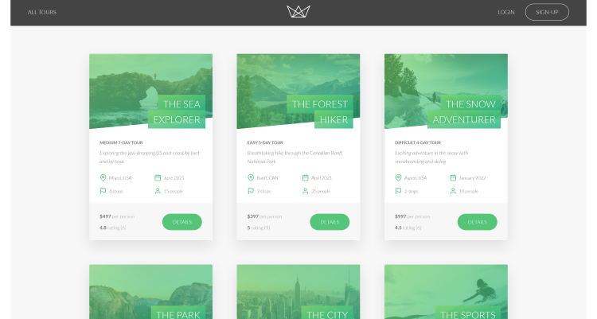
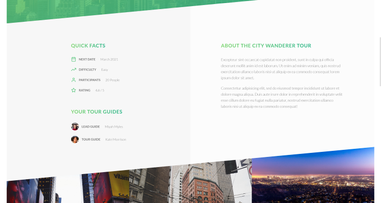
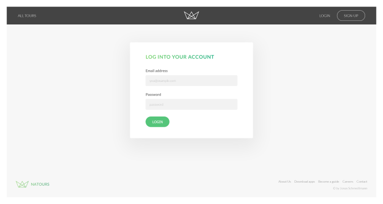
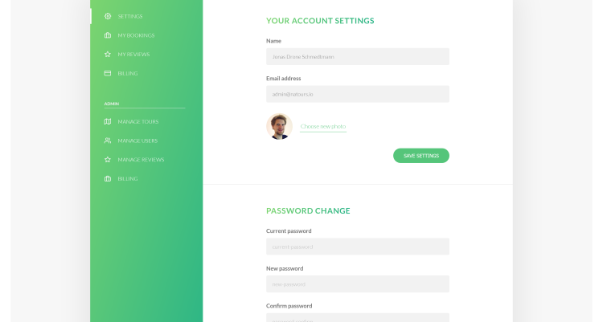
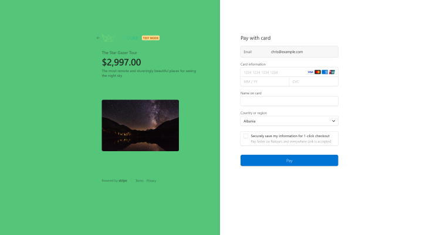
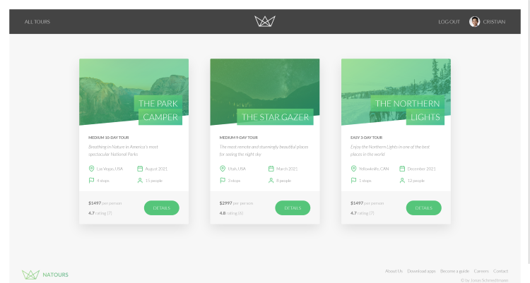
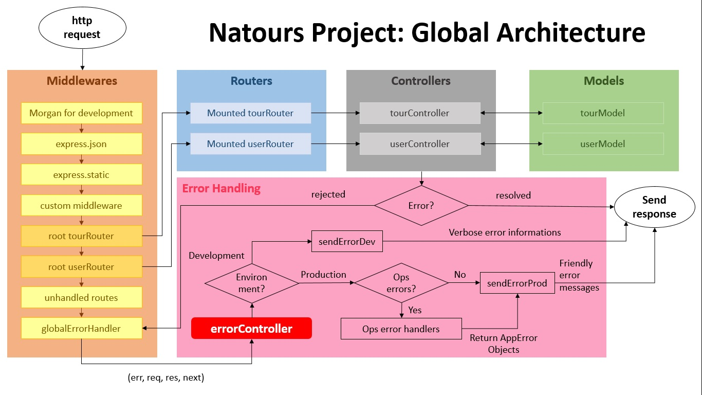

# Natours App

This web-app is designed to keep track of a users job application status. A user that is hunting for a job can enter information about that job including the name of the company, the location of the job, type of job (full-time, part-time, internship), the title of the position and the status of the application (Pending, Interview or declined). The app records and displays all jobs that have been applied for and shows stats for the past 6 months of job applications in a bar or area graph. The user can also search

This is my solution to the Jobify web app from John Smilga's MERN Stack Course 2023 - MongoDB, Express, React and NodeJS.

## Table of contents

- [Overview](#overview)
  - [The challenge](#the-challenge)
  - [Screenshot](#screenshot)
  - [Links](#links)
  - [Built with](#built-with)
  - [What I learned](#what-i-learned)
  - [Continued development](#continued-development)
  - [Useful resources](#useful-resources)
  - [Author](#author)

## Overview

### The challenge

Users should be able to:

- Securely register and login to web-app
- Ability to add and edit and delete jobs
- Change user profile and update DB
- Search through all jobs using any one of the search fields

### Screenshot

### Links

\*\* NOTE - This version is not responsive yet. Must be viewed on laptop or desktop screen

- Solution URL: [Github-rep](https://github.com/PeshwariNaan/node-design-project.git)
- Live Site URL: [Live-Link](https://jds-nature-tours.herokuapp.com/)

### Built with

- Node.js
- MVC architecture (model, view, controller)
- Server-side redering with Pug templates
- MongoDB / Atlas
- Mongoose V6
- Express
- Postman
- JWT for authentication and authorization (using secure cookies)
- RESTful API design and development with advanced features: filtering, sorting, aliasing, pagination
- Advanced MongoDB: geospatial queries, aggregation pipeline, and operators
- Advanced data modelling: relationships between data, embedding and referencing
- Stripe payment portal implementation
- Advanced error handling
- [Heroku](https://www.heroku.com/) - Hosting service

### What I learned

This particular course is packed with content and there are too many things to list so I will try to keep it focused on what I felt was new and important in my personal journey.

- The content that I learned the most from was the advanced usage of MongoDB and Mongoose and the RESTFUL API developement. This includes the use of query strings and the development of query middleware and how to work with the request body. Building advanced data models that use child and parent referencing between them.

- How to use virtual population where you fetch referenced documents that are not persisted in the database and display them in the query result. An example of this is how each individual tour can have many reviews and the reviews have their own model. Rather than creating a reference that persists in the DB, which could contain hundreds of items, we can connect them through a virtual populate.

- Complex error handling. I learned how to separate the operational and programming errors. This way you can send useful messages to the user if something goes wrong with user error and keep the programming errors for use by only the developers. This system was difficult to learn and I'm still a little shaky on the details. Below is a flow chart that helps illustrates the error handling.
  

- Full payment implementation using Stripe. I have actully used stripe several times in the past but nothing close to how it was used in this project. I was unaware of what could be done with it such personalizing check out screens.

- This was the first time I have used server-side rendering using Pug and Pug templates and also the first time using parcel bundler. It was interesting to work through it but I found the flow not very straight forward overly complex at times. I would like to explore other ways of server-side rendering in the future.

### Continued development

The path forward from this project truthfully leads me back towards other technologies that I have already learned. The knowledge that I gained through the API development, Mongo, Mongoose, and numerous others are invaluable, but I don't plan to continue building in this manner. I would like to use what I have built here and apply it to a React full stack application instead. There are a few routes that we developed for the api that were not implemented on the application. Rather than continue expanding this application, I will build a new one that utilizes all the routes and I can do different styling. I feel this will help me fully understand what we covered in this course.

### Useful resources

- [Mongoose Docs](https://mongoosejs.com/docs/)

## Author

- [J.D. Browne](https://github.com/PeshwariNaan)
